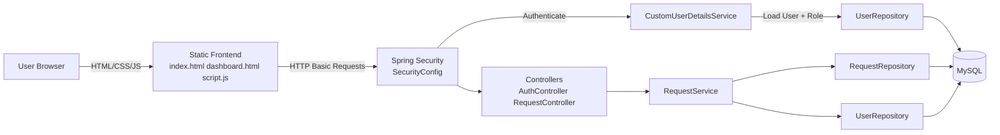
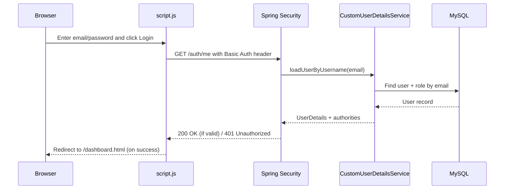
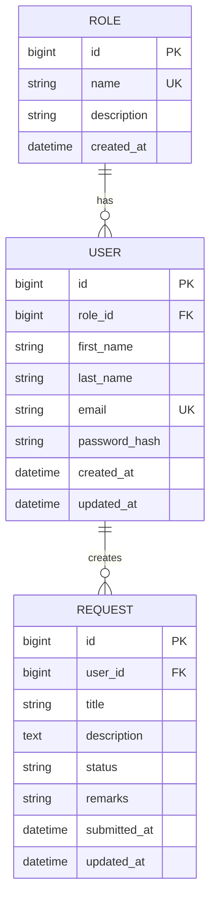

# DETAIL README - Digital Approval Workflow System

## 1) Project Overview
Digital Approval Workflow System ek Spring Boot based web application hai jisme users requests create karte hain, approvers unhe approve/reject karte hain, aur admins sab kuch monitor kar sakte hain.

### Core Goal
- Manual approval process ko digital workflow me convert karna
- Role-based access ke saath secure APIs dena
- Request lifecycle track karna (PENDING -> APPROVED/REJECTED)

---

## 2) Tech Stack
- Backend: Spring Boot 3.2.3
- Language: Java 17
- Security: Spring Security (HTTP Basic Auth)
- Database: MySQL
- ORM: Spring Data JPA + Hibernate
- Validation: Jakarta Validation
- Build Tool: Maven
- Frontend: Static HTML/CSS/JavaScript (Spring Boot `static` folder)

---

## 3) High-Level Architecture
1. Browser se user login/register karta hai.
2. Frontend JS credentials ko sessionStorage me store karta hai.
3. Har secured API request me `Authorization: Basic base64(email:password)` header jata hai.
4. Spring Security user ko authenticate karta hai using `CustomUserDetailsService`.
5. Role ke hisab se endpoint access allow/deny hota hai.
6. Request service database operations perform karti hai.
7. Response frontend table/dashboard me render hota hai.

---

## 4) Entry Points and Navigation
- `/` -> redirect to `/index.html`
- `/index.html` -> login + register page
- `/dashboard.html` -> role-based dashboard
- `/test` -> quick test endpoint (`Project is running successfully`)

---

## 5) Security and Roles
Security rules `SecurityConfig` me defined hain.

### Public Routes
- `/`
- `/index.html`, `/login.html`, `/dashboard.html`
- `/style.css`, `/script.js`, `/css/**`, `/js/**`
- `POST /auth/register`

### Authenticated / Role-Based Routes
- `GET /auth/me` -> authenticated user
- `POST /requests` -> `ROLE_USER`
- `GET /requests` -> `ROLE_USER`, `ROLE_APPROVER`, `ROLE_ADMIN`
- `GET /requests/pending` -> `ROLE_APPROVER`, `ROLE_ADMIN`
- `PUT /requests/{id}/approve` -> `ROLE_APPROVER`
- `PUT /requests/{id}/reject` -> `ROLE_APPROVER`
- Any other endpoint -> `ROLE_ADMIN`

### Notes
- CSRF disabled hai (API + basic auth scenario ke liye)
- Password hashing `BCryptPasswordEncoder` se hota hai
- Unauthorized case me JSON message return hota hai: `{"message":"Unauthorized"}`

---

## 6) Database Model
### `roles` table
- `id`
- `name` (unique) e.g. USER / APPROVER / ADMIN
- `description`
- `created_at`

### `users` table
- `id`
- `role_id` (Many users -> One role)
- `first_name`
- `last_name`
- `email` (unique)
- `password_hash`
- `created_at`, `updated_at`

### `requests` table
- `id`
- `user_id` (Many requests -> One user)
- `title`
- `description`
- `status` (default `PENDING`)
- `remarks`
- `submitted_at`
- `updated_at`

---

## 7) Backend Folder-by-Folder Responsibility

## Main Application
- `src/main/java/com/example/digitalapproval/DigitalApprovalWorkflowSystemApplication.java`
  - Spring Boot app start point

## Config
- `src/main/java/com/example/digitalapproval/config/SecurityConfig.java`
  - Security filter chain
  - Endpoint authorization rules
  - Auth provider + password encoder

## Controllers
- `AuthController.java`
  - Register user
  - Current logged-in user info (`/auth/me`)
- `RequestController.java`
  - Create request
  - Fetch all/pending requests
  - Approve/Reject request
- `HomeController.java`
  - Root redirect to index page
- `TestController.java`
  - Health/test response

## Services
- `RequestService.java`
  - Core business logic for request workflow
  - Status transitions and persistence

## Security
- `CustomUserDetailsService.java`
  - Email se user load karta hai
  - User role ko Spring authorities me convert karta hai

## Repositories
- `UserRepository.java`
  - `findByEmail`
  - `findByEmailWithRole`
  - `findProfileByEmail` (projection)
- `RoleRepository.java`
  - role lookup (`findByNameIgnoreCase`)
- `RequestRepository.java`
  - request queries (by status, by user)

## Entities
- `User.java`
- `Role.java`
- `Request.java`

## DTOs
- `RegisterRequestDto.java`
- `AuthMeResponseDto.java`
- `RequestCreateDto.java`
- `RequestDecisionDto.java`
- `RequestResponseDto.java`
- `ApiResponseDto.java`

---

## 8) Frontend File Responsibility

### Primary (Active) Flow
- `src/main/resources/static/index.html`
  - Login + Register UI
- `src/main/resources/static/dashboard.html`
  - Dashboard UI (table + create form)
- `src/main/resources/static/script.js`
  - Login, register, auth headers, role-based rendering, request actions
- `src/main/resources/static/style.css`
  - Main UI styling

### Alternate / Legacy-like Flow (Project me present hai)
- `src/main/resources/static/login.html`
- `src/main/resources/static/js/app.js`
- `src/main/resources/static/css/styles.css`

These files bhi functional ho sakte hain, but root redirect currently `index.html` use karta hai, isliye practical main flow `index.html + script.js + style.css` hai.

---

## 9) API Contract Summary

### Auth APIs
#### `POST /auth/register`
Request:
```json
{
  "firstName": "Aman",
  "lastName": "Kumar",
  "email": "aman@example.com",
  "password": "secret123"
}
```
Response: message DTO

#### `GET /auth/me` (authenticated)
Response:
```json
{
  "id": 1,
  "email": "aman@example.com",
  "role": "USER"
}
```

### Request APIs
#### `POST /requests` (`ROLE_USER`)
```json
{
  "title": "Laptop approval",
  "description": "Need new laptop",
  "userId": 1
}
```

#### `GET /requests`
- USER: frontend apni requests filter karta hai by `userId`
- ADMIN: all requests

#### `GET /requests/pending`
- APPROVER/ADMIN ke liye pending items

#### `PUT /requests/{id}/approve`
```json
{
  "remarks": "Approved for Q1"
}
```

#### `PUT /requests/{id}/reject`
```json
{
  "remarks": "Insufficient justification"
}
```

---

## 10) Request Lifecycle (Business Flow)
1. USER login karta hai
2. USER request create karta hai -> status `PENDING`
3. APPROVER pending list dekhta hai
4. APPROVER approve/reject karta hai with optional remarks
5. Request status final state me update hota hai
6. ADMIN all requests monitor kar sakta hai

---

## 11) Validation Rules
- Register:
  - firstName required (max 100)
  - email required + valid + max 150
  - password required (6 to 100)
- Request Create:
  - title required (max 150)
  - description optional (max 2000)
  - userId required
- Decision:
  - remarks optional (max 500)

---

## 12) Local Setup and Run
## Prerequisites
- Java 17
- Maven
- MySQL running
- Database created: `digital_approval_db`

## Steps
1. `application.properties` me DB credentials check/update karo
2. Project root me run karo:
   ```bash
   mvn spring-boot:run
   ```
3. Browser open karo:
   - `http://localhost:8080/`

---

## 13) Important Operational Notes
- Current `application.properties` me plain DB password saved hai; production me env variables/secrets use karo.
- HTTP Basic me credentials request headers me jate hain; production me HTTPS mandatory hai.
- `spring.jpa.hibernate.ddl-auto=update` dev ke liye convenient hai; production me controlled migrations use karo (Flyway/Liquibase).

---

## 14) Change Guide (Agar aapko kuch modify karna ho)

### A) New role add karna hai
- Security rule update: `SecurityConfig.java`
- Role seed/creation logic: `AuthController.java` ya DB seed script
- UI behavior per role: `script.js`

### B) Request me naya field add karna hai (e.g. priority)
1. Entity update: `Request.java`
2. DTO update: `RequestCreateDto.java`, `RequestResponseDto.java`
3. Service mapping update: `RequestService.java`
4. Frontend form/table update: `dashboard.html`, `script.js`

### C) Approval policy change karni hai
- Decision logic: `RequestService.java`
- Endpoint restrictions: `SecurityConfig.java`

### D) Login mechanism Basic se JWT me shift karna hai
- New auth endpoints/token generation: `AuthController`
- Security filter rewrite: `SecurityConfig`
- Frontend header logic update: `script.js`

### E) UI redesign karna hai
- Structure: `index.html`, `dashboard.html`
- Logic: `script.js`
- Styles: `style.css`

---

## 15) Recommended Cleanup (Optional but Useful)
- Decide single frontend flow:
  - Keep either (`index.html + script.js + style.css`) OR (`login.html + js/app.js + css/styles.css`)
- Unused flow ko remove karo to avoid confusion.
- Add proper unit/integration tests for:
  - request transitions
  - role access rules
  - auth failures

---

## 16) Testing
Current test file:
- `src/test/java/com/example/digitalapproval/DigitalApprovalWorkflowSystemApplicationTests.java`

Abhi sirf context load test hai. Functional tests add karne par confidence aur badhega.

---

## 17) Quick Explain Script (Interview/Presentation ke liye)
"Ye project Spring Boot based digital approval system hai. User request create karta hai, approver pending requests ko approve/reject karta hai, admin sab requests monitor karta hai. Security role-based hai using Spring Security + Basic Auth. Data MySQL me JPA entities ke through persist hota hai. Frontend static HTML/JS based dashboard hai jo role ke hisab se alag behavior show karta hai."

---

## 18) Maintainer Notes for Future You
- Change karte time always flow check karo: Entity -> DTO -> Service -> Controller -> Frontend
- Security changes karte waqt endpoint matrix dobara verify karo
- Any schema change ke baad data migration strategy socho
- Sensitive values ko source code me hardcode mat rakho

---

## 19) Mermaid Diagrams

### A) System Architecture


### B) Login + Auth Flow (Sequence)


### C) Request Lifecycle Flow
```mermaid
flowchart TD
  A[USER creates request\nPOST /requests] --> B[PENDING]
  B --> C[APPROVER views pending\nGET /requests/pending]
  C --> D{Decision}
  D -->|Approve| E[PUT /requests/{id}/approve]
  D -->|Reject| F[PUT /requests/{id}/reject]
  E --> G[APPROVED]
  F --> H[REJECTED]
  G --> I[Visible to ADMIN in /requests]
  H --> I
```

## 20) Final Notes
- Ye README aapko project explain karne, handover dene, aur safe changes karne ke liye end-to-end reference deta hai.
- Change karte waqt small commits aur role-based API testing follow karo.

## 21) ER Diagram (Database Relations)


